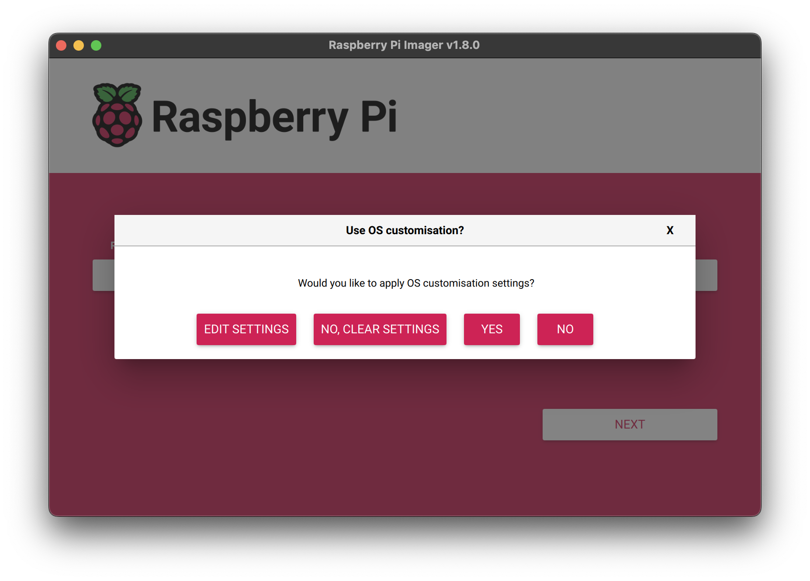

# snapress

snapress is a way to share photos in person instead of online

run this code on linux

---

## instructions (raspberry pi)

1. if you're using a raspberry pi, get that setup [[instructions](https://www.raspberrypi.com/documentation/computers/getting-started.html#install-using-imager)]
2. once you reach the settings page (below), click "Edit Settings" and do the following:
    * keep the raspberry.local
    * set the username and password (i'll be using *snapress* for the username for the rest of this)
    * add your wifi (if you have the nano, it has to be the 2.4ghz since it doesn't support 5g)
    * click select locale settings

3. put the sd card into the raspberry pi and plug the raspberry pi in for power (its on when the green light stops blinking)
4. on your computer type
